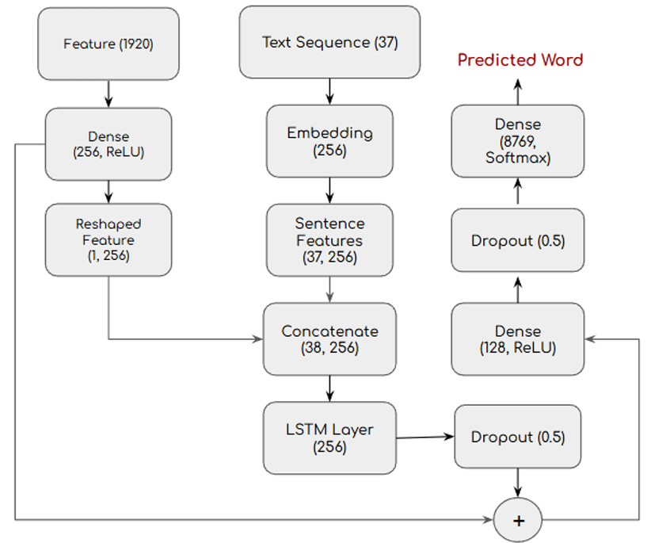
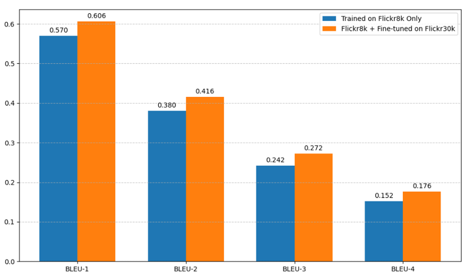
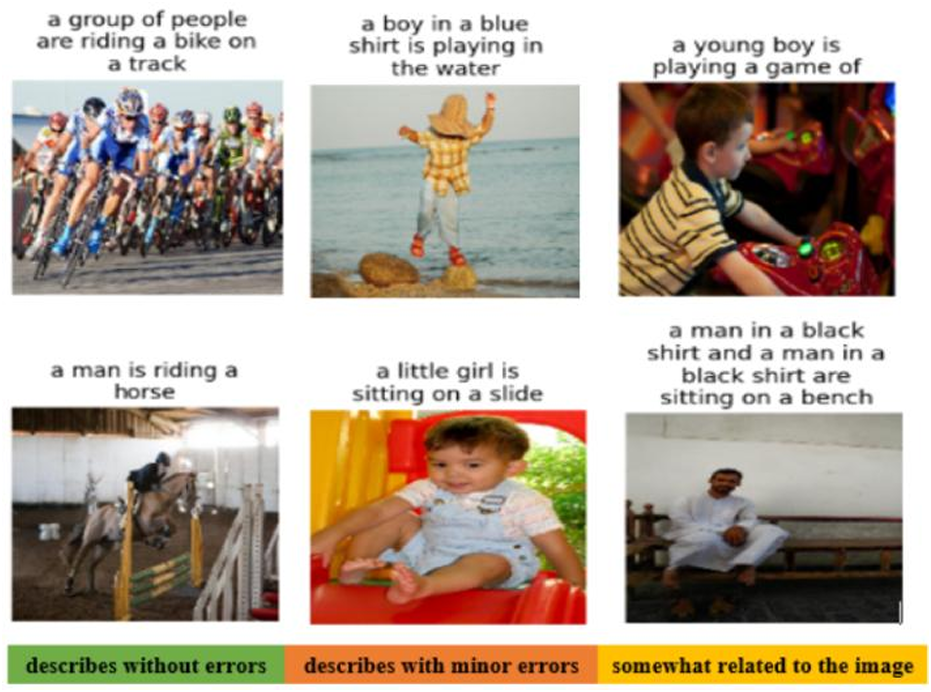
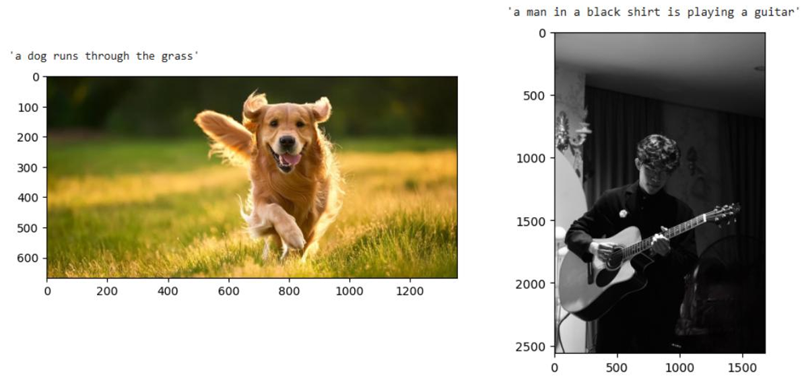

# AI Image Captioning (CNN + LSTM)

## 🚀 Live Demo (Google Colab)

The easiest way to run and experiment with this project is to open it directly in Google Colab. You can "Save a copy in Drive" to run and modify it.

[](https://colab.research.google.com/drive/1fBYzpftlQeCsP66-vkJTQ4UAQ2kiqFj9)

---

## 💡 Project Overview

This project implements a deep learning model to automatically generate descriptive captions for images. It uses the classic "Encoder-Decoder" architecture, leveraging a pre-trained CNN (DenseNet201) as the Encoder and an LSTM as the Decoder.

---

## ✨ Key Features

* **Encoder (DenseNet201):** Uses a pre-trained DenseNet201, frozen during initial training, to extract rich, high-level image features.
* **Decoder (LSTM):** Employs a Long Short-Term Memory (LSTM) network to generate captions sequentially (word-by-word) based on the image features.
* **Two-Phase Training:**
    1. **Base Training:** The model is first trained on the **Flickr8k** dataset.
    2. **Fine-Tuning:** The model is then fine-tuned on the larger **Flickr30k** dataset to improve caption quality and generalization.
* **Evaluation:** Model performance is rigorously measured using **BLEU-1, BLEU-2, BLEU-3, and BLEU-4** scores to compare generated captions against human references.

---

## ⚙️ Detailed Model Architecture

The model merges two pathways: an image feature stream (left) and a text sequence stream (right).

1. **Image Encoder (Left):** The 1920-dimensional feature vector from DenseNet201 is passed through a Dense layer (256 units) and reshaped to `(1, 256)`.
2. **Text Decoder (Middle):** The input text sequence (max length 37) is passed through an Embedding layer (256 units).
3. **Concatenate:** The image feature `(1, 256)` is prepended to the text sequence `(37, 256)`, creating a combined sequence of `(38, 256)`.
4. **LSTM:** An LSTM layer (256 units) processes this combined sequence.
5. **Output:** The result is passed through Dropout (0.5), Dense (128 units), and another Dropout (0.5) layer before a final Softmax (8769 units) predicts the next word.



---

## 📊 Results & Evaluation

### 1. Quantitative Results (BLEU Scores)

Fine-tuning on the Flickr30k dataset significantly improved the scores across all BLEU metrics compared to training on Flickr8k alone.



| Metric     | Trained on Flickr8k Only | Fine-tuned on Flickr30k |
|------------|--------------------------|--------------------------|
| **BLEU-1** | 0.570                    | **0.606**                |
| **BLEU-2** | 0.380                    | **0.416**                |
| **BLEU-3** | 0.242                    | **0.272**                |
| **BLEU-4** | 0.152                    | **0.176**                |

### 2. Qualitative Results (In-Sample)

The model demonstrates a strong ability to accurately describe primary subjects and actions but occasionally makes minor errors related to fine-grained details or attributes.



### 3. Out-of-Sample Test

The model generalizes well to entirely new images, accurately describing common scenes not present in the training data.



---

## 🛠️ Tech Stack & Environment

* **Core:** Python `3.10+`, TensorFlow `2.10+`, Keras  
* **Data Handling:** Pandas, NumPy, Scikit-learn  
* **NLP & Evaluation:** NLTK  
* **Utilities:** `kagglehub` (for dataset download), Matplotlib  
* **Environment:** Trained on Google Colab using an NVIDIA Tesla T4 GPU

---

## 🚀 How to Run (Locally)

1. **Clone Repo:**
    ```bash
    git clone https://github.com/hiepp1/image-captioning.git
    cd image-captioning
    ```
2. **Install Dependencies:**
    ```bash
    pip install tensorflow pandas scikit-learn nltk kagglehub matplotlib
    ```
3. **Setup Kaggle API:**
    This project downloads datasets via `kagglehub`. You will need to have your Kaggle API token (`kaggle.json`) set up in your `~/.kaggle/` directory.
4. **Run:**
    Execute the `source.py` file (or run the notebook cells) to automatically download datasets, train the model, and evaluate the results.
